  

  
  
  

  

## About Me

I am Punith H U, a developer building practical projects while learning modern web development, Git, GitHub, JavaScript, TypeScript, and React. My GitHub currently has **13 repositories**: **6 public** projects visible on my profile and **7 private** projects in progress.

## Tech Stack

  

## Public Projects

  
  

  
  

  
  

## GitHub Dashboard

  

## Stats

  
  

  

  

